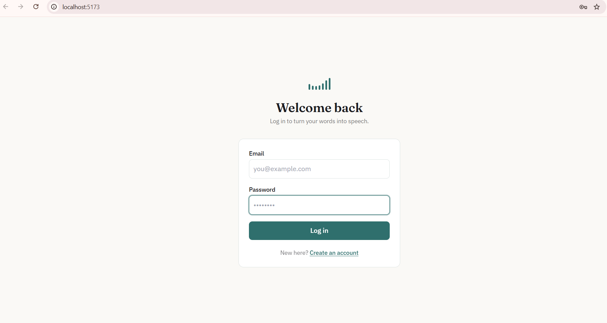
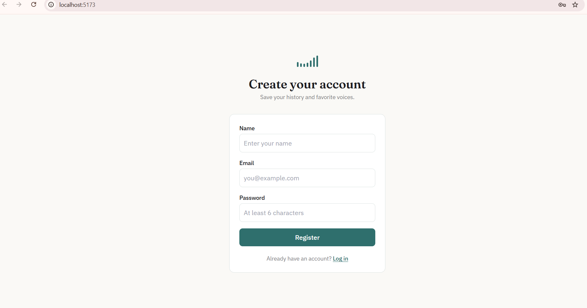
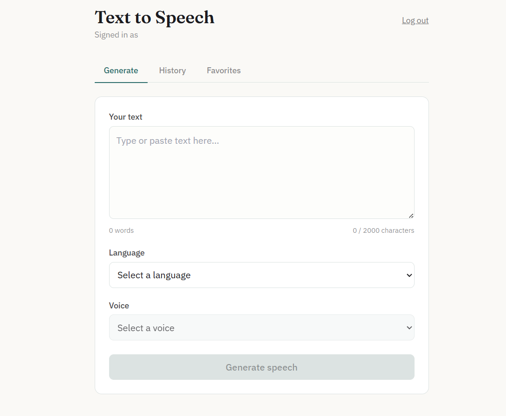
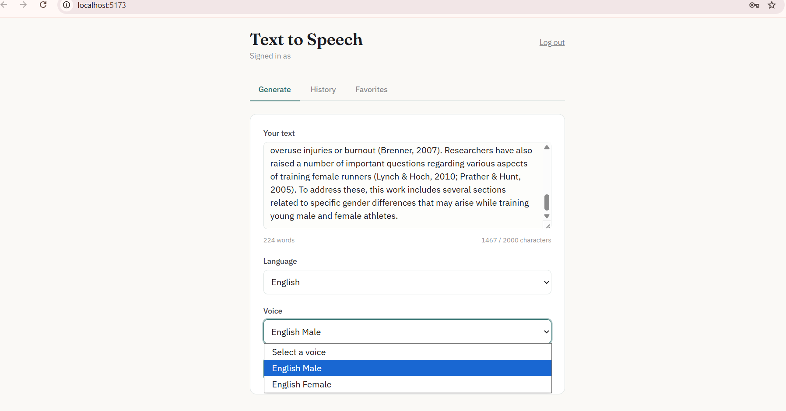
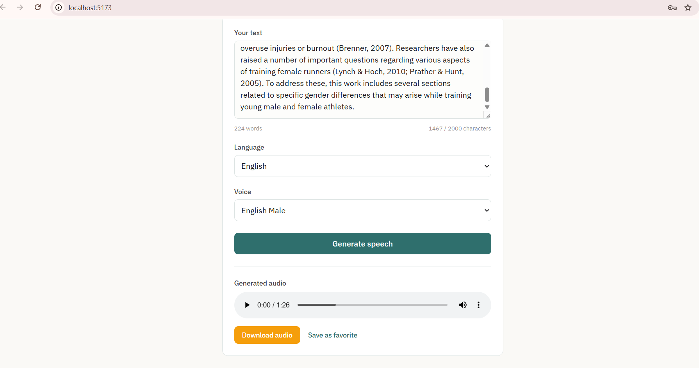
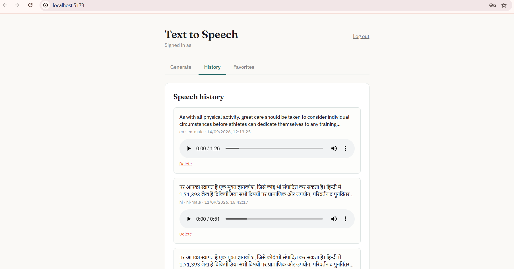
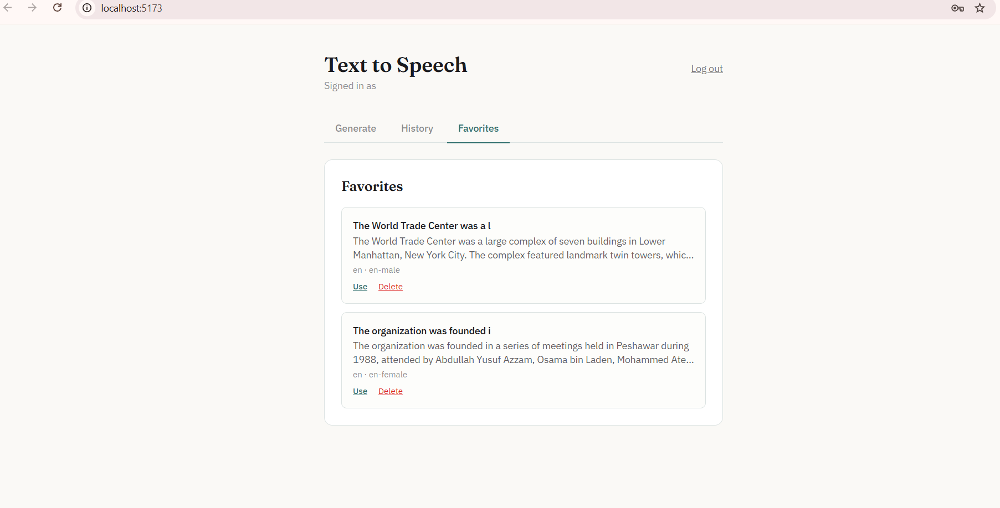

#  Text-to-Speech Application

A full-stack web-based Text-to-Speech (TTS) application that converts written text into natural-sounding speech.

The application allows users to enter or paste text, select a language and voice, generate speech, listen to the generated audio, download the audio, maintain speech history, and manage favorite speech entries.

This project is implemented using **React.js + Python Flask + SQLite + Edge TTS + JWT Authentication**.

---

##  Project Overview

The Text-to-Speech Application provides an easy way to convert written content into spoken audio.

Users can:

- Enter or paste text
- Select a supported language
- Select an available voice
- Generate speech
- Play the generated audio
- Download generated audio
- View speech history
- Delete history entries
- Save speech entries as favorites
- Delete favorites
- Register and log in securely

The project follows a full-stack architecture where the React frontend communicates with a Flask REST API backend, and the backend communicates with the Text-to-Speech service.

---

##  Problem Statement

Reading large amounts of text can be difficult for some users. A Text-to-Speech application provides an alternative way to consume written information through audio.

The application provides a simple interface where users can:

1. Enter text
2. Select a language
3. Select an available voice
4. Convert text into speech
5. Play the generated audio
6. Download the generated audio
7. Clear or modify the text
8. Handle invalid input and API errors

---

##  Objectives

The main objectives of this project are:

- Understand frontend and backend communication
- Learn how REST APIs work
- Integrate a Text-to-Speech service
- Process user input on the backend
- Generate and return audio
- Implement user authentication
- Store speech history
- Implement favorites
- Handle API errors and invalid input
- Build a responsive user interface
- Practice database management
- Understand basic security practices
- Learn how a full-stack application works

---

#  Features

## 1. Text Input

Users can enter or paste text into the text input area.

The application supports:

- Text entry
- Text modification
- Character counting
- Input validation
- Maximum text length validation
- Empty text validation

---

## 2. Language Selection

Users can select the language in which the text should be spoken.

### Supported Languages

- 🇬🇧 English
- 🇮🇳 Hindi
- 🇮🇳 Gujarati
- 🇮🇳 Marathi
- 🇪🇸 Spanish
- 🇫🇷 French
- 🇩🇪 German

---

## 3. Voice Selection

Users can select an available voice according to the selected language.

The application supports multiple voice options including:

- Male voices
- Female voices
- Different languages

The selected voice is passed from the React frontend to the Flask backend and then to the Edge TTS service.

---

## 4. Generate Speech

After entering text and selecting a language and voice, the user can click:

**Generate Speech**

The frontend sends the request to the backend.

The backend:

1. Validates the request
2. Validates the selected language
3. Validates the selected voice
4. Sends the text to the Text-to-Speech service
5. Generates an MP3 audio file
6. Returns the audio URL
7. Stores speech history for authenticated users

---

## 5. Audio Player

After successful speech generation, the generated audio can be played directly in the browser.

The audio player supports normal browser audio controls such as:

- Play
- Pause
- Seek
- Volume control

---

## 6. Download Audio

Users can download the generated speech audio as an MP3 file.

---

## 7. User Authentication

The application provides:

- User registration
- User login
- JWT-based authentication
- Protected history APIs
- Protected favorites APIs

Passwords are stored using password hashing rather than plain text.

JWT access tokens are used to authenticate protected API requests.

---

## 8. Speech History

Authenticated users can view previously generated speech entries.

Each history record stores:

- Text
- Language
- Voice
- Audio URL
- Creation date
- User ID

Users can also delete individual history records.

---

## 9. Favorites

Users can save frequently used speech entries as favorites.

A favorite contains:

- Label
- Text
- Language
- Voice
- Creation date
- User ID

Users can:

- Add favorites
- View favorites
- Delete favorites

---

## 10. Error Handling

The application handles different types of invalid requests and failures, including:

- Empty text
- Text exceeding the maximum allowed length
- Invalid language
- Invalid voice
- Network errors
- Authentication errors
- Server errors
- Text-to-Speech service failures

---

# 📸 Screenshots

## Login



## Registration



## Text-to-Speech



## Voice Selection



## Generated Audio



## Speech History



## Favorites



#  Application Architecture

```text
                    ┌────────────────────┐
                    │       User         │
                    └─────────┬──────────┘
                              │
                              ▼
                    ┌────────────────────┐
                    │  React Frontend    │
                    │                    │
                    │ - Text Input       │
                    │ - Language         │
                    │ - Voice Selection  │
                    │ - Audio Player     │
                    │ - History          │
                    │ - Favorites       │
                    └─────────┬──────────┘
                              │
                         HTTP / REST
                              │
                              ▼
                    ┌────────────────────┐
                    │   Flask Backend    │
                    │                    │
                    │ - Authentication   │
                    │ - Validation       │
                    │ - TTS API          │
                    │ - History          │
                    │ - Favorites       │
                    └──────┬─────┬───────┘
                           │     │
                 ┌─────────┘     └──────────┐
                 ▼                          ▼
        ┌──────────────────┐       ┌─────────────────┐
        │    SQLite DB     │       │    Edge TTS     │
        │                  │       │                 │
        │ - Users          │       │ Speech          │
        │ - History        │       │ Generation      │
        │ - Favorites      │       │                 │
        └──────────────────┘       └────────┬────────┘
                                            │
                                            ▼
                                     Generated MP3
                                            │
                                            ▼
                                     React Audio Player
```

---

# 🛠️ Technology Stack

## Frontend

- HTML5
- CSS3
- JavaScript
- React.js
- Vite
- Axios
- Tailwind CSS

## Backend

- Python
- Flask
- Flask-CORS
- Flask-JWT-Extended
- Flask-SQLAlchemy
- Werkzeug

## Database

- SQLite
- SQLAlchemy ORM

## Text-to-Speech

- Edge TTS

## Authentication

- JSON Web Token (JWT)

---

#  Project Structure

```text
text-to-speech/
│
├── .gitignore
├── README.md
│
├── backend/
│   │
│   ├── app.py
│   ├── config.py
│   ├── requirements.txt
│   │
│   ├── models/
│   │   ├── user.py
│   │   ├── speech_history.py
│   │   └── favorite.py
│   │
│   ├── routes/
│   │   ├── auth_routes.py
│   │   ├── tts_routes.py
│   │   ├── history_routes.py
│   │   └── favorites_routes.py
│   │
│   ├── services/
│   │   └── tts_service.py
│   │
│   └── utils/
│       └── validators.py
│
└── frontend/
    │
    ├── package.json
    ├── package-lock.json
    ├── vite.config.js
    ├── tailwind.config.js
    ├── postcss.config.js
    │
    ├── public/
    │   ├── favicon.svg
    │   └── icons.svg
    │
    └── src/
        │
        ├── App.jsx
        ├── App.css
        ├── index.css
        ├── main.jsx
        ├── api.js
        │
        ├── assets/
        │
        └── components/
            ├── AudioPlayer.jsx
            ├── DownloadButton.jsx
            ├── ErrorMessage.jsx
            ├── Favorites.jsx
            ├── GenerateButton.jsx
            ├── History.jsx
            ├── LanguageSelector.jsx
            ├── Login.jsx
            ├── Register.jsx
            ├── TextInput.jsx
            └── VoiceSelector.jsx
```

---

#  Application Flow

```text
User
  │
  ▼
React Frontend
  │
  │ HTTP Request
  ▼
Flask REST API
  │
  ├── Validate Input
  │
  ├── Validate Language
  │
  ├── Validate Voice
  │
  ▼
Edge TTS Service
  │
  ▼
Generate MP3
  │
  ▼
Flask Backend
  │
  ├── Save History
  │
  ▼
Return Audio URL
  │
  ▼
React Frontend
  │
  ├── Play Audio
  └── Download Audio
```

---

#  Authentication Flow

```text
User Registration
       │
       ▼
POST /api/auth/register
       │
       ▼
Create User
       │
       ▼
Hash Password
       │
       ▼
Generate JWT
       │
       ▼
Return Access Token
```

Login follows:

```text
User Login
    │
    ▼
POST /api/auth/login
    │
    ▼
Validate Email
    │
    ▼
Verify Password
    │
    ▼
Generate JWT
    │
    ▼
Return Access Token
```

The frontend stores the access token and sends it with authenticated requests:

```text
Authorization: Bearer <access_token>
```

---

#  Database Schema

The application uses SQLite with SQLAlchemy.

## Users Table

```text
users
--------------------------------
id              INTEGER  PK
name            VARCHAR
email           VARCHAR  UNIQUE
password_hash   VARCHAR
```

## Speech History Table

```text
speech_history
--------------------------------
id              INTEGER  PK
user_id         INTEGER  FK
text            TEXT
language        VARCHAR
voice           VARCHAR
audio_url       VARCHAR
created_at      DATETIME
```

## Favorites Table

```text
favorites
--------------------------------
id              INTEGER  PK
user_id         INTEGER  FK
label           VARCHAR
text            TEXT
language        VARCHAR
voice           VARCHAR
created_at      DATETIME
```

---

#  API Documentation

Base URL:

```text
http://127.0.0.1:5000
```

---

## Authentication APIs

### Register

```http
POST /api/auth/register
```

Request:

```json
{
  "name": "John",
  "email": "john@example.com",
  "password": "password123"
}
```

Successful response:

```json
{
  "success": true,
  "message": "Registration successful!",
  "access_token": "<JWT_TOKEN>",
  "user": {
    "id": 1,
    "name": "John",
    "email": "john@example.com"
  }
}
```

---

### Login

```http
POST /api/auth/login
```

Request:

```json
{
  "email": "john@example.com",
  "password": "password123"
}
```

Successful response:

```json
{
  "success": true,
  "message": "Login successful!",
  "access_token": "<JWT_TOKEN>",
  "user": {
    "id": 1,
    "name": "John",
    "email": "john@example.com"
  }
}
```

---

#  Text-to-Speech APIs

## Generate Speech

```http
POST /api/tts
```

Request:

```json
{
  "text": "Hello! Welcome to the Text-to-Speech application.",
  "language": "en",
  "voice": "en-female"
}
```

Successful response:

```json
{
  "success": true,
  "audio_url": "/audio/generated-file.mp3"
}
```

---

## Get Available Voices

```http
GET /api/voices
```

Example response:

```json
{
  "success": true,
  "languages": {
    "en": "English",
    "hi": "Hindi",
    "gu": "Gujarati",
    "mr": "Marathi",
    "es": "Spanish",
    "fr": "French",
    "de": "German"
  },
  "voices": {}
}
```

---

## Health Check

```http
GET /api/health
```

Response:

```json
{
  "status": "ok"
}
```

---

#  History APIs

## Get Speech History

```http
GET /api/history
```

Authentication required.

---

## Delete History

```http
DELETE /api/history/<id>
```

Authentication required.

---

#  Favorites APIs

## Get Favorites

```http
GET /api/favorites
```

Authentication required.

---

## Add Favorite

```http
POST /api/favorites
```

Request:

```json
{
  "label": "Welcome Message",
  "text": "Hello! Welcome to our application.",
  "language": "en",
  "voice": "en-female"
}
```

Authentication required.

---

## Delete Favorite

```http
DELETE /api/favorites/<id>
```

Authentication required.

---

#  HTTP Status Codes

The API uses appropriate HTTP status codes.

| Status Code | Meaning |
|---|---|
| 200 | Successful request |
| 201 | Resource created |
| 400 | Invalid request |
| 401 | Unauthorized |
| 404 | Resource not found |
| 409 | Conflict |
| 503 | Text-to-Speech service unavailable |

---

#  Installation

## Prerequisites

Make sure the following are installed:

- Python 3.x
- Node.js
- npm
- Git

---

#  Backend Setup

Open PowerShell and navigate to the backend:

```powershell
cd backend
```

Create a virtual environment if required:

```powershell
python -m venv venv
```

Activate the virtual environment:

```powershell
.\venv\Scripts\Activate.ps1
```

Install dependencies:

```powershell
pip install -r requirements.txt
```

Start the backend:

```powershell
python app.py
```

The backend will run at:

```text
http://127.0.0.1:5000
```

---

#  Frontend Setup

Open another terminal.

Navigate to the frontend:

```powershell
cd frontend
```

Install dependencies:

```powershell
npm install
```

Start the development server:

```powershell
npm run dev
```

The frontend will normally run at:

```text
http://localhost:5173
```

---

#  Environment Variables

Sensitive configuration should not be committed to GitHub.

Create a `.env` file inside the backend directory if required:

```text
backend/.env
```

Example:

```env
JWT_SECRET_KEY=your-secret-key
```

**Do not commit the real `.env` file to GitHub.**

The project `.gitignore` excludes environment files, database files, generated audio files, virtual environments, cache files, and local IDE configuration.

---

# 🧪 Testing

Testing should cover both frontend and backend functionality.

## Frontend Testing

Test the following:

- Empty text input
- Long text input
- Character limit
- Language selection
- Voice selection
- Generate Speech button
- Loading state
- Audio playback
- Audio download
- Login
- Registration
- History
- Favorites
- Error messages

---

## API Testing

The following endpoints can be tested using Postman:

```text
POST /api/auth/register
POST /api/auth/login
POST /api/tts
GET /api/voices
GET /api/health
GET /api/history
DELETE /api/history/<id>
GET /api/favorites
POST /api/favorites
DELETE /api/favorites/<id>
```

---

## Error Testing

Test cases include:

- Empty text
- Excessively long text
- Invalid language
- Invalid voice
- Invalid authentication token
- Missing authentication token
- Network failure
- Text-to-Speech service failure
- Invalid request data
- Server errors

---

#  Security

The project follows basic security practices:

- Passwords are hashed before storage
- JWT authentication is used for protected endpoints
- Sensitive environment variables are excluded from Git
- Database files are excluded from Git
- Generated audio files are excluded from Git
- User input is validated on the backend
- Voice and language combinations are validated
- Authentication is required for user-specific history and favorites
- API credentials/secrets should not be exposed in the frontend

---

# Git and GitHub

The project uses Git for version control.

Files that should not be committed include:

```text
.env
*.db
*.sqlite
*.mp3
__pycache__/
venv/
node_modules/
.vscode/
```

These files are excluded through `.gitignore`.

---

# Future Enhancements

Possible future improvements include:

- Additional languages
- Additional voices
- Voice customization
- Speaking speed control
- Pitch control
- Volume control
- Text file upload
- PDF/DOCX upload
- AI text enhancement
- Cloud audio storage
- Usage limits
- Admin dashboard
- Analytics
- Cloud deployment

---

# Learning Outcomes

Through this project, the following concepts were practiced:

- Full-stack web application structure
- React frontend development
- Flask backend development
- REST API development
- Frontend-backend communication
- Axios API communication
- JSON request and response handling
- Text-to-Speech service integration
- Audio file generation
- Database management
- SQLAlchemy ORM
- JWT authentication
- Password hashing
- Input validation
- Error handling
- Git and GitHub
- API testing using Postman

---

# Project Level

This project follows the **Level 2 – Intermediate** version of the Text-to-Speech application.

### Level 2 includes:

- React
- Backend
- Database
- Text-to-Speech API/service
- Authentication
- User accounts
- Speech history
- Download
- Favorites
- Multiple voices

---

#  Author

**Manjushree**

Text-to-Speech Application  
Full-Stack Development Project

